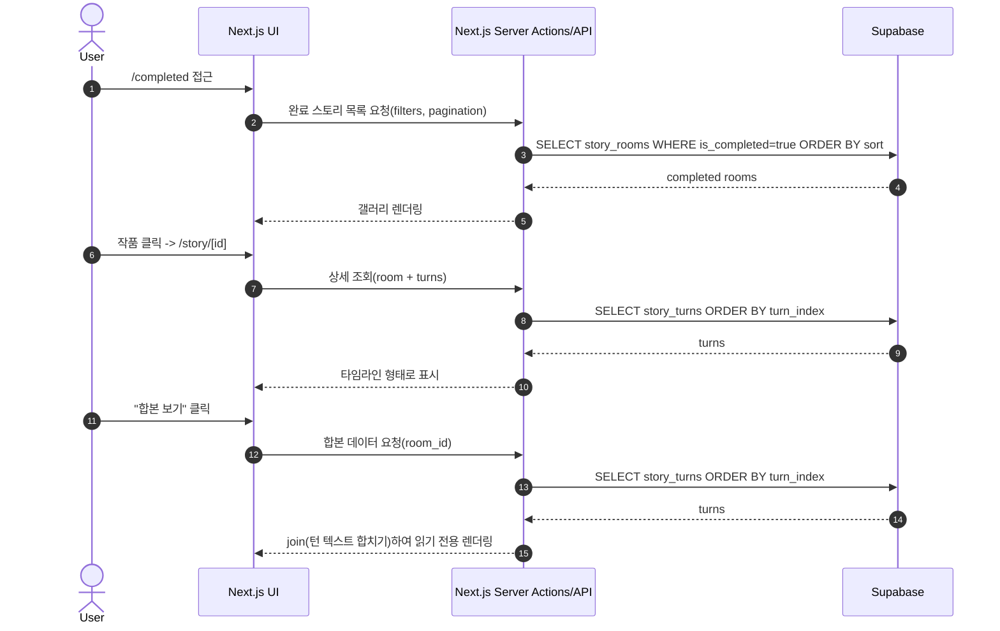
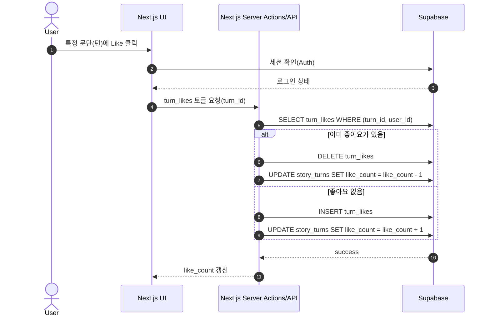

````md
# StoryRelay — flow.md
> Purpose: PRD 기반 전체 사용자 흐름/로직과 페이지 구조를 Cursor AI가 빠르게 이해할 수 있도록 정리한 문서
> Stack: Next.js App Router + Supabase + Tailwind + shadcn/ui + OpenAI (guide)
---

## 1) Sequence Diagram — 핵심 사용자 여정 & 로직 흐름 (Phase 1 중심)

### 1-1. 로그인/탐색/읽기/이어쓰기(락) 기본 플로우

```mermaid
sequenceDiagram
  autonumber
  actor U as User
  participant UI as Next.js UI (Client)
  participant API as Next.js Server Actions/API
  participant SB as Supabase (Auth/DB)
  participant AI as OpenAI API

  U->>UI: 방문 (홈)
  UI->>SB: 세션 확인(Auth)
  SB-->>UI: 로그인 상태/비로그인 상태

  U->>UI: 장르/태그/정렬 선택
  UI->>API: 스토리 목록 조회 요청(filters, pagination)
  API->>SB: SELECT story_rooms (filters + pagination)
  SB-->>API: story_rooms rows
  API-->>UI: 목록 렌더링

  U->>UI: 스토리 카드 클릭
  UI->>API: 스토리 상세 조회 요청(room_id)
  API->>SB: SELECT story_rooms + story_turns ORDER BY turn_index
  SB-->>API: room + turns
  API-->>UI: 상세 페이지 렌더링

  alt 비로그인 사용자가 "이어쓰기" 클릭
    U->>UI: Continue Writing 클릭
    UI-->>U: Login required modal
  else 로그인 사용자가 "이어쓰기" 클릭
    U->>UI: Continue Writing 클릭
    UI->>API: lock 획득 시도(room_id)
    API->>SB: RPC check_and_acquire_lock(room_id, user_id)
    SB-->>API: lock acquired / denied (lock holder, expire_at)
    API-->>UI: lock 성공이면 editor 활성화, 실패면 비활성 + 안내
  end

  U->>UI: 문단 작성 후 Submit
  UI->>API: Turn 저장 요청(room_id, content)
  API->>SB: (서버) lock 검증 + turn_index 계산(MAX+1)
  API->>SB: INSERT story_turns(room_id, author_id, content, turn_index)
  API->>SB: UPDATE story_rooms (release_lock, total_authors 갱신)
  SB-->>API: success
  API-->>UI: 새 턴 반영(리렌더)

  U->>UI: AI 작성 가이드 버튼 클릭
  UI->>API: POST /api/guide (room_id or recent context)
  API->>SB: story_turns 일부 조회 (최근 N턴)
  SB-->>API: context
  API->>AI: prompt(톤 분석 + 작성 팁)
  AI-->>API: guide text
  API-->>UI: 가이드 표시
````

---

### 1-2. 스토리 생성 플로우 (첫 문단 포함)

```mermaid
sequenceDiagram
  autonumber
  actor U as User
  participant UI as Next.js UI
  participant API as Next.js Server Actions/API
  participant SB as Supabase

  U->>UI: /story/create 접근
  UI->>SB: 세션 확인(Auth)
  SB-->>UI: 로그인 상태

  U->>UI: 제목/장르(선택)/태그/첫 문단 입력
  U->>UI: Create 버튼 클릭
  UI->>API: 스토리 생성 요청(payload)
  API->>SB: INSERT story_rooms(title, genre, tags, created_by)
  SB-->>API: room_id 반환
  API->>SB: INSERT story_turns(room_id, author_id, content, turn_index=1)
  API->>SB: UPDATE story_rooms(total_authors=1)
  SB-->>API: success
  API-->>UI: /story/[room_id]로 이동
```

---

### 1-3. 완성 작품 갤러리 + 합본 보기(읽기 전용)



---

### 1-4. 문단별 좋아요(턴 좋아요) 토글 플로우



---

## 2) Flowchart — 서비스 아키텍처 & 페이지 구조 (Phase 1 + Phase 2 자리 포함)

```mermaid
flowchart TD
  A[Landing/Home /] --> B{Auth 상태}
  B -->|Guest| C[Home - Story Discovery]
  B -->|Logged In| C

  C --> C1[Hero CTA]
  C --> C2[Challenge Banner Section]
  C --> C3[Popular Authors Section]
  C --> C4[Filters: Genre/Tag/Sort]
  C --> C5[Story List + Pagination]

  C5 --> D[/story/[id]\nStory Detail]
  C --> E[/story/create\nCreate Story]:::authOnly
  C --> F[/completed\nCompleted Gallery]
  C --> G[/challenges\nChallenges]
  C --> H[/ranking\nRankings (Phase2)]:::phase2
  C --> I[/profile\nMy Profile]:::authOnly

  D --> D1[Read Timeline (turns)]
  D --> D2[Turn Like Buttons]
  D --> D3[Author Popover]
  D --> D4[AI Writing Guide Button]
  D --> D5[Continue Writing Button]
  D --> D6[Full Story Mode Button]

  D5 --> J{Lock Acquire}
  J -->|Lock OK| K[Writing Editor Active\n(5-min lock notice)]
  J -->|Denied| L[Editor Disabled + Message]

  K --> M[Submit Turn]
  M --> D1

  D6 --> N[Full Story Read Mode\n(join turns text)]

  F --> F1[Completed Filter/Sort/Pagination]
  F1 --> D

  I --> I1[Tabs: Started/Participated]
  I --> I2[Stats: turns/likes/completions]
  I --> I3[Badges]
  I --> I4[My Liked Stories (optional Phase1)]
  I --> I5[/profile/[id]\nAuthor Profile Detail]

  G --> G1[Challenge List]
  G --> G2[Award Winners Gallery]
  G --> G3[Challenge Progress UI]
  G2 --> D

  classDef authOnly fill:#fff,stroke:#111,stroke-width:2px,stroke-dasharray: 6 4;
  classDef phase2 fill:#f6f6f6,stroke:#999,stroke-width:1px,stroke-dasharray: 2 2;
```

---

## 3) Notes — Phase 2 UI placeholders (UI만 자리 확보)

* Rankings Page `/ranking` (Phase 2): UI만 존재, 데이터/로직은 나중
* Turn Queue / Approval UI: Story Detail 하단/사이드에 placeholder 컴포넌트로만 배치
* Follow system, realtime 알림: Profile/Author detail에 placeholder만 배치

---

## 4) Optional: 시스템 내부 로직(개발자 체크리스트)

* Lock 획득/해제는 서버에서만 처리 (Server Action or RPC)
* turn_index는 서버에서 MAX+1 계산
* 좋아요는 UNIQUE 제약으로 중복 방지 + 카운트는 트랜잭션/RPC 추천
* Completed Gallery는 story_rooms.is_completed = true 필터링