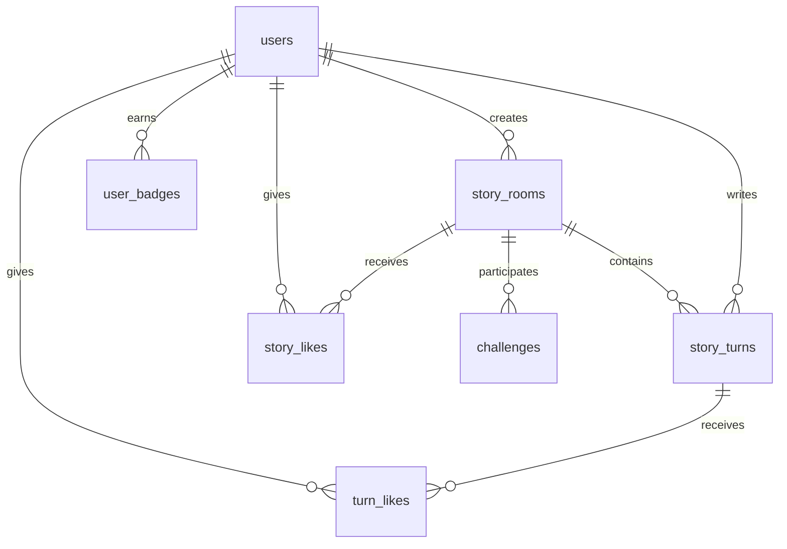

# PRD (for Cursor AI)
---

## 1. Project Overview

**서비스명:** StoryRelay

**한 줄 정의:** 여러 사용자가 한 문단씩 이어 쓰며 하나의 이야기를 함께 완성하는 협업형 창작 플랫폼

### 해결하려는 핵심 문제

- 혼자서는 글을 끝까지 쓰기 어렵다
- 협업 창작은 동시성 문제 때문에 구현이 복잡하다
- 완성된 작품을 감상하고 영감을 얻을 수 있는 공간이 필요하다

### AI의 역할

- 스토리 줄거리 자동 요약 (사용자 이해도 향상)
- 작성 가이드 및 팁 제공
- (Phase 2) 문장 아이디어 추천

---

## 2. User Persona & User Flow

### 주요 타겟 유저

1. 글쓰기 취미가 있지만 꾸준히 못 하는 대학생
2. 웹소설 입문자
3. 짧게 창작하고 싶은 직장인/개발자
4. 다른 사람들의 창작물을 읽고 영감을 얻고 싶은 독자

---

### 🟢 Phase 1 핵심 유저 시나리오

#### 시나리오 A: 스토리 참여자

1. 사용자가 로그인한다
2. 홈 화면에서 스토리 방 목록을 본다
3. 장르/태그로 스토리를 필터링한다
4. 스토리 방을 선택한다
5. 현재까지 내용을 읽는다
6. "이어쓰기 시작" 버튼을 누른다
7. 시스템이 Lock을 잡는다
8. 사용자가 문단을 작성하고 제출한다
9. 다음 참여자가 이어 쓴다

#### 시나리오 B: 스토리 생성자

1. 사용자가 로그인한다
2. "새 스토리 만들기" 버튼을 클릭한다
3. 스토리 제목, 장르, 첫 문단, 태그를 입력한다
4. 스토리 방이 생성되고 다른 사용자들이 참여할 수 있다

#### 시나리오 C: 완성 작품 감상자

1. 사용자가 "완성 작품" 메뉴를 클릭한다
2. 완성된 스토리 목록을 장르/인기순으로 필터링한다
3. 관심 있는 작품을 선택하여 전체 내용을 읽는다
4. 마음에 드는 작품에 좋아요를 누른다
5. 작품에 참여한 작가들의 프로필을 확인한다

#### 시나리오 D: 작가 활동 추적

1. 프로필 페이지에서 내가 참여한 스토리 목록 조회
2. 내가 작성한 문단별 좋아요 수 확인
3. 인기 작가 섹션에서 다른 작가들의 활동 확인
4. 관심 있는 작가의 프로필 페이지 방문

---

## 3. 🚦 Traffic Light Key Features

### 🟢 Phase 1 (Core — 지금 당장 구현)

| 기능 | 설명 |
| --- | --- |
| 로그인/회원가입 | Supabase Auth |
| 스토리 방 생성 | 제목, 장르(선택), 태그, 첫 문단 입력 |
| 스토리 목록 조회 | 카드 UI, 페이지네이션 |
| 장르/태그 필터 | DB 쿼리 기반 |
| 스토리 읽기 | 전체 턴 타임라인 형태로 표시 |
| 이어쓰기 | 새 턴 작성 후 저장 |
| 🔒 Turn Lock 시스템 | 동시 작성 방지 |
| AI 작성 가이드 | 스토리 톤 분석 및 작성 팁 제공 |
| 문단별 좋아요 | 각 턴에 개별 좋아요 기능 |
| 작가 프로필 미니 카드 | 팝오버 형태로 작가 정보 표시 |
| **완성 작품 갤러리** | **완성된 스토리 전용 페이지** |
| 인기 작가 섹션 | 작가 검색 및 통계 표시 |
| 챌린지 시스템 | 진행 중 컨테스트, 진행률, 수상작 갤러리 |
| 프로필 페이지 | 참여 스토리, 통계, 배지 시스템 |

---

### 🟡 Phase 2 (Advanced — DB 설계만 포함)

| 기능 | 설명 |
| --- | --- |
| 턴 대기열 시스템 | Lock 대기 알림 |
| 턴 투표 승인 시스템 | 트롤 방지 |
| 문장 아이디어 추천 | AI 생성 |
| 스토리 랭킹 페이지 | 점수 기반 정렬 |
| 실시간 알림 | 새 턴, 좋아요 알림 |
| 작가 팔로우 시스템 | 팔로워/팔로잉 기능 |

---

### 🔴 Out (이번 구현 제외)

- 실시간 채팅
- 이미지 업로드
- 오디오북 생성
- 댓글 시스템
- 소셜 미디어 연동

---

## 4. Tech Stack & Data Modeling (DBA-Strict)

### Tech Stack

- **Frontend:** Next.js 16 App Router + Tailwind CSS v4 + shadcn/ui
- **Backend/DB:** Supabase (PostgreSQL + Auth)
- **Deployment:** Vercel
- **AI 모델:** OpenAI GPT-4o-mini (요약 및 가이드용)

---

### ERD 설계

---

### story_rooms

| 컬럼 | 타입 | 설명 |
| --- | --- | --- |
| id | uuid PK |  |
| title | text | 스토리 제목 |
| genre | text default 'free' | 장르 |
| tags | text[] | 태그 배열 |
| created_by | uuid FK | 생성자 ID |
| current_lock_user_id | uuid | 현재 작성 중인 사용자 |
| lock_expire_at | timestamp | Lock 만료 시간 |
| like_count | integer default 0 | 전체 좋아요 수 |
| is_completed | boolean default false | 완성 여부 |
| completed_at | timestamp | 완성 시각 |
| total_authors | integer | 참여 작가 수 |
| cover_image | text | 커버 이미지 URL |

---

### story_turns

| 컬럼 | 타입 | 설명 |
| --- | --- | --- |
| id | uuid PK |  |
| room_id | uuid FK | 스토리 방 ID |
| author_id | uuid FK | 작성자 ID |
| content | text | 문단 내용 |
| turn_index | int | 턴 순서 |
| like_count | integer default 0 | 턴별 좋아요 수 |
| created_at | timestamp | 작성 시각 |

---

### story_likes (스토리 단위 좋아요)

| 컬럼 | 타입 |
| --- | --- |
| id | uuid PK |
| room_id | uuid FK |
| user_id | uuid FK |
| created_at | timestamp |

---

### turn_likes (턴 단위 좋아요)

| 컬럼 | 타입 |
| --- | --- |
| id | uuid PK |
| turn_id | uuid FK |
| user_id | uuid FK |
| created_at | timestamp |

---

### challenges

| 컬럼 | 타입 | 설명 |
| --- | --- | --- |
| id | uuid PK |  |
| title | text | 챌린지 제목 |
| description | text | 설명 |
| theme | text | 주제 |
| start_at | timestamp | 시작 시각 |
| end_at | timestamp | 종료 시각 |
| status | text | active/upcoming/ended |
| participants | integer | 참여자 수 |
| winner_story_id | uuid FK | 우승작 ID |

---

### user_badges

| 컬럼 | 타입 | 설명 |
| --- | --- | --- |
| id | uuid PK |  |
| user_id | uuid FK | 사용자 ID |
| badge_type | text | 배지 종류 |
| earned_at | timestamp | 획득 시각 |

---

## 5. Page Structure & Navigation

### 메뉴 구조

1. **홈** (`/`)
   - 히어로 섹션 (로그인 시 "새 스토리 만들기" + "이야기 이어쓰기")
   - 챌린지 배너
   - 인기 작가 섹션
   - 진행 중인 스토리 목록 (필터 + 페이지네이션)

2. **완성 작품** (`/completed`)
   - 완성된 스토리 전용 갤러리
   - 장르/인기순/최신순 필터
   - 커버 이미지 + 통계 (턴 수, 작가 수, 좋아요)
   - 페이지네이션

3. **챌린지** (`/challenges`)
   - 진행 중/예정/종료된 챌린지
   - 챌린지별 진행률 표시
   - 수상작 갤러리 (명예의 전당)
   - 참여 뱃지 시스템

4. **랭킹** (`/ranking`) - Phase 2
   - 인기 스토리 랭킹
   - 인기 작가 랭킹
   - 장르별/기간별 필터

5. **프로필** (`/profile`)
   - 내가 시작한 스토리 / 참여한 스토리 탭
   - 통계 (총 턴 수, 받은 좋아요, 완성한 스토리)
   - 획득한 배지

6. **스토리 상세** (`/story/[id]`)
   - 타임라인 형태의 턴 표시
   - 각 턴별 좋아요 버튼
   - 작가 프로필 팝오버
   - 이어쓰기 에디터 + AI 작성 가이드

7. **새 스토리 만들기** (`/story/create`)
   - 제목, 장르, 첫 문단, 태그 입력
   - 실시간 유효성 검사

8. **작가 프로필 상세** (`/profile/[id]`)
   - 작가 통계 및 배지
   - 시작한 스토리 / 참여한 스토리 목록

---

## 6. Design System & UI/UX Guidelines

### 디자인 원칙

1. **Glassmorphism 활용**
   - 반투명 배경 + backdrop-blur
   - 그라데이션 오버레이로 깊이감 연출

2. **Micro-interactions**
   - 버튼 hover 시 scale 효과
   - 카드 hover 시 lift 애니메이션
   - 아이콘 회전/pulse 효과

3. **색상 시스템**
   - Primary: 주요 액션 (버튼, 링크)
   - Secondary: 보조 강조
   - Muted: 배경 및 비활성
   - Destructive: 좋아요 (하트 색상)

4. **타이포그래피**
   - 제목: font-bold, text-balance
   - 본문: leading-relaxed, text-pretty
   - 통계 숫자: tabular-nums

5. **레이아웃 우선순위**
   - Flexbox 우선 사용
   - Grid는 복잡한 2D 레이아웃에만
   - 반응형: mobile-first 접근

---

## 7. Cursor AI Implementation Guide

### 🔧 개발 규칙

1. **인증은 Supabase Auth만 사용**
2. **모든 DB 접근은 Supabase client 사용**
3. Lock 로직은 서버 액션에서 처리
4. Turn 저장 시 반드시:
   - 현재 Lock 사용자 검증
   - turn_index = 이전 최대값 + 1
   - 작가 수 업데이트 (DISTINCT author_id)
5. AI 가이드는 별도 API route `/api/guide`에서 처리
6. Phase 1 범위를 벗어나는 기능 구현 금지
7. 완성 작품은 `is_completed = true`로 필터링
8. 페이지네이션은 항목당 9개씩 표시

---

## 8. Success Metrics

| 기준 | 목표 |
| --- | --- |
| 사용자 로그인 성공 | 가능해야 함 |
| 스토리 방 생성 | 동작 |
| 이어쓰기 저장 | 정상 DB 저장 |
| Lock 동작 | 동시 작성 방지 성공 |
| AI 가이드 버튼 | 가이드 텍스트 반환 |
| 완성 작품 갤러리 | 필터 및 페이지네이션 동작 |
| 문단별 좋아요 | 개별 턴 좋아요 카운트 증가 |
| 작가 프로필 상세 | 통계 및 작품 목록 표시 |

---